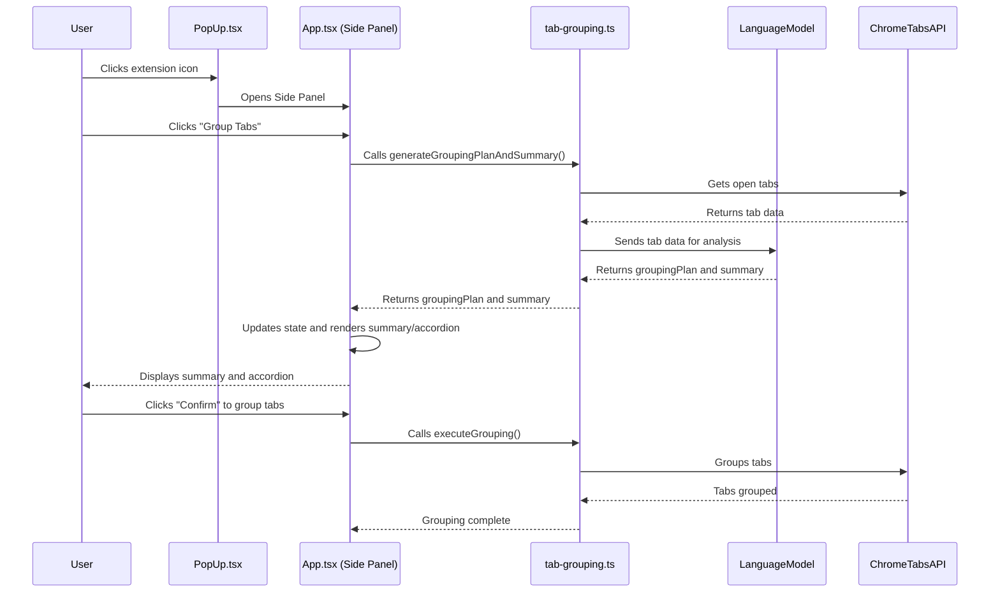

# Architecture

This document outlines the architecture of the Session Summary Chrome extension, detailing the core components, data flows, and UI interactions.

## File Structure

The project is organized into the following key files and directories:

-   **`src/`**: The main source code directory.
    -   **`main.tsx`**: The entry point of the React application for the side panel.
    -   **`App.tsx`**: The main UI component for the side panel that manages the application's state and renders the UI.
    -   **`popup/`**: Contains the React components for the extension's popup.
        -   **`main.tsx`**: The entry point for the popup.
        -   **`PopUp.tsx`**: The main UI component for the popup, primarily used to open the side panel.
    -   **`handler/tab-grouping.ts`**: Contains the logic for interacting with the Chrome Tabs API, processing tabs, and communicating with the language model.
    -   **`components/DownloadingModel.tsx`**: A reusable React component for displaying the model download progress.
    -   **`theme.ts`**: Defines the Material UI theme (light theme) for consistent styling across the application.
-   **`public/`**: Contains public assets like `manifest.json`, icons, and the HTML pages.
-   **`dist/`**: The build output directory.

## Core Concepts

-   **Session Summary:** The core feature of the extension, which provides an AI-powered summary of the user's browsing session.
-   **Tab Grouping:** The process of organizing open tabs into logical groups based on their content.
-   **Local Language Model:** The extension uses a local language model to ensure user privacy and data security.
-   **Material UI:** The UI is built using Material UI components for a professional and consistent design.

## Architectural Flow

The following diagram illustrates the flow of data and interactions between the core components when a user groups their tabs:



## UI Component Interaction

The UI is built with React and Material UI, and is composed of several components that work together to provide a seamless user experience.

```mermaid
graph TD
    A[main.tsx (Side Panel Entry)] --> B(App.tsx)
    A[popup/main.tsx (Popup Entry)] --> C(popup/PopUp.tsx)
    B --> D(components/DownloadingModel.tsx)
    B --> E(src/theme.ts)
```

-   **`main.tsx`**: Renders the main `App` component for the side panel.
-   **`App.tsx`**: The central component for the side panel, managing state, logic, and rendering. It utilizes `DownloadingModel` for download progress and `lightTheme` for styling.
-   **`popup/main.tsx`**: Renders the `PopUp` component.
-   **`popup/PopUp.tsx`**: A simple component that opens the side panel when the extension icon is clicked.
-   **`components/DownloadingModel.tsx`**: Displays the download progress of the local language model.
-   **`src/theme.ts`**: Provides the Material UI theme configuration for the application.